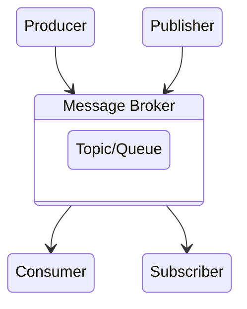

## Асинхронная передача сообщений

Системы асинхронной передачи сообщений являются нечто средним между RPC и базами данных.

От RPC - доствка данных другому процессу без значительной задержки.  
От баз данных - сообщение проходит через посредника (message broker), или очередь (message queue), или иное промежуточное ПО.

## Преимущества перед RPC

1. Может служить буфером в случае неоступности или перегруженности получателя.
2. Обеспечивает повторную отправку сбойным получателям.
3. Отправитель не привязан к адресам каждого из получателей.
4. Распространение одного сообщения на несколько получателей.

## Общая схема взаимодействия

## AMQP

### [1. AMPQ (protocol)](data.mq.ampq.md)

### [2. RabbitMQ](data.mq.rabbit-mq.md)
