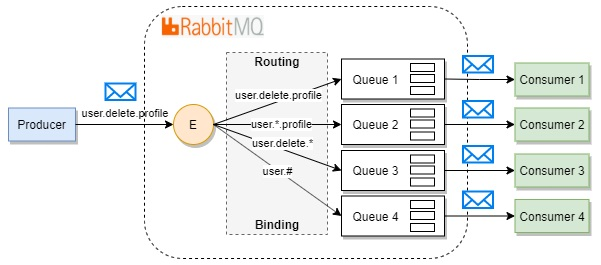
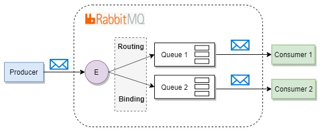

## Введение

RabbitMQ - брокер сообщений, маршрутизующий их с использованием    
базовых принципов AMQP.
&nbsp;

Основная идея модели обмена сообщениями в RabbitMQ заключается в том, что producer (издатель) не отправляет сообщения непосредственно в очередь. На самом деле и довольно часто издатель даже не знает, будет ли сообщение вообще доставлено в какую-либо очередь.    
&nbsp;

&nbsp;

## Принцип работы
  
&nbsp;
Кратко работу RabbitMQ можно описать следующим образом:

1. Издатель отправляет сообщение определенному обменнику
2. Обменник, получив сообщение, маршрутизирует его в одну или несколько очередей в соответствии с правилами привязки между ним и очередью
3. Очередь хранит ссылку на это сообщение. Само сообщение хранится в оперативной памяти или на диске
4. Как только потребитель готов получить сообщение из очереди, сервер создает копию сообщения по ссылке и отправляет
5. Потребитель получает сообщение и отправляет брокеру подтверждение
6. Брокер, получив подтверждение, удаляет копию сообщения из очереди.   
7. Затем удаляет из оперативной памяти и с диска

## Подключения и каналы

Практически все взяимодействия с ядром RabbitMQ происходят    
через RPC (Remote procedure call)   
&nbsp;

Для такого обмена информацией между клиентом и сервером используются каналы. Каналы создаются в рамках определенного подключения. Каждый канал изолирован от других каналов. 
&nbsp;

## Exchanges

По умолчанию RabbitMQ использует DirectExchange.

### 1. DirectExchange
&nbsp;

### 2. TopicExchange
&nbsp;

### 3. FanoutExchange
&nbsp;

## Queues

### 1. Временные очереди   
&nbsp;    
***AutoDelete***   
Очереди со способностью автоматически удалять себя.   
Она создается в момент подключения первого клиента и автоматически удаляется, когда последний клиент отсоединились.    

***Exclusive***   
Очередь, поддерживающая только одного клиента и удаляемая когда этот клиент отсоединился.

### 2. Постоянные очереди   
&nbsp;   
***Durable***   
Если очередь создается с параметром _durable_, то такая очередь сохраняет свое состояние    
и восстанавливается после остановки/перезапуска сервера.

### 3. Highly available очереди &nbsp;   

HA очереди требуют кластерной среды RabbitMQ, при этом информация об exchanges, bindings, queues, потребителях копируется на все узлы кластера.   

Сообщения, публикуемые в такие очереди, хранятся на всех узлах кластера.   
Когда сообщение прочитывается на одном из узлов, его копии на других узлах удаляются.