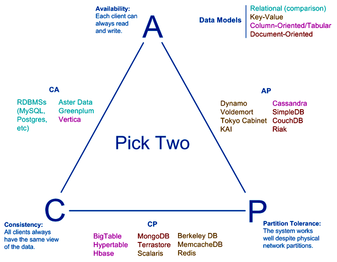

## CAP определение

В CAP говорится, что в распределенной системе возможно выбрать только 2 из 3-х свойств:
* C (consistency) — согласованность. Каждое чтение даст вам самую последнюю запись.
* A (availability) — доступность. Каждый узел (не упавший) всегда успешно выполняет запросы (на чтение и запись).
* P (partition tolerance) — устойчивость к распределению. Даже если между узлами нет связи, они продолжают работать независимо друг от друга.

___

## Недостатки теоремы

Проблемы CAP теоремы:
* Далёкие от реального мира определения
* В рамках разработки, выбор в основном лежит между CP и AP
* Множество систем — просто P
* Чистые AP и CP системы могут быть не тем, что ожидаешь

___