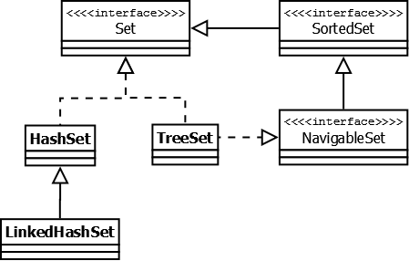

## Оглавление:

[Collections API](#collections-framework)  
[1. Map](#map-interface)  
[2. List](#list-interface)  
[3. Set](#set-interface)  
[4. Queue](#queue-interface)  
[5. Time complexity (table)](#time-complexity-table)  
[Полезные ссылки](#полезные-ссылки)

## Collections framework

**Collection** - в версии Java 8, было добавлено несколько новых методов для работы с лямбдами (такие как stream(), parallelStream(), removeIf(Predicate<? super E> filter) и др.).

**Map** - в версии Java 8 появились дополнительные методы для работы с лямбдами, а также методы, которые зачастую реализовались в логике приложения (getOrDefault(Object key, V defaultValue), putIfAbsent(K key, V value)).

## Map interface

**HashMap** - порядок хранения элементов зависит от хэш-функции. Добавление элемента выполняется за константное время O(1), но время удаления, получения зависит от распределения хэш-функции. В идеале является константным, но может быть и линейным O(n).
Внутри содержит массив связных списков (т.н. бакетов), каждый связный список, при достижении длинны в 64 элемента, переходит в структуру красно-черного дерева.

TreeMap — реализация Map основанная на красно-чёрных деревьях. Является упорядоченной. По-умолчанию, коллекция сортируется по ключам с использованием принципа "natural ordering", но это поведение может быть настроено под конкретную задачу при помощи объекта Comparator, который указывается в качестве параметра при создании объекта TreeMap.

## List interface

**ArrayList** - реализация списка на основе обычного массива. Константное получение элементов по индексу.

**LinkedList** - двунаправленный связный список. Благодаря этому, добавление и удаление из середины, доступ по индексу, значению происходит за линейное время O(n), а из начала и конца за константное O(1).

## Set interface

**HashSet** — реализация интерфейса Set, базирующаяся на HashMap. Внутри использует объект HashMap для хранения данных.  
В качестве ключа используется добавляемый элемент, а в качестве значения — объект-пустышка (new Object()). Из-за особенностей реализации порядок элементов не гарантируется при добавлении.

**TreeSet** — аналогично другим классам-реализациям интерфейса Set содержит в себе объект NavigableMap, что и обуславливает его поведение.  
Предоставляет возможность управлять порядком элементов в коллекции при помощи объекта Comparator, либо сохраняет элементы с использованием "natural ordering".

## Queue interface

Этот интерфейс описывает коллекции с предопределённым способом вставки и извлечения элементов, а именно — очереди FIFO (first-in-first-out).  
Помимо методов, определённых в интерфейсе Collection, определяет дополнительные методы для извлечения и добавления элементов в очередь.

**ArrayDeque** — реализация интерфейса Deque, который расширяет интерфейс Queue методами, позволяющими реализовать конструкцию вида LIFO (last-in-first-out).  
Эта коллекция представляет собой реализацию с использованием массивов, подобно ArrayList, но не позволяет обращаться к элементам по индексу и хранение null. Как заявлено в документации, коллекция работает быстрее чем Stack, если используется как LIFO коллекция, а также быстрее чем LinkedList, если используется как FIFO.

## Time complexity (table)

---

## Полезные ссылки

1. [Оригинал полной статьи](https://habr.com/ru/post/237043/)
