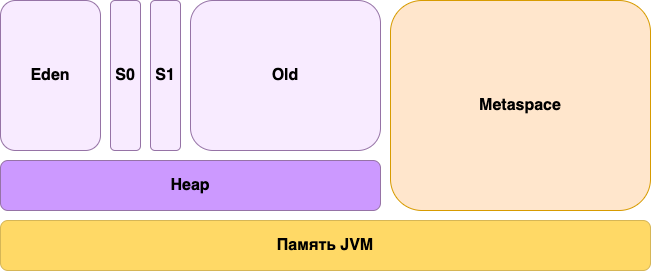

## JDK, JRE, JVM

## Оглавление:

[1. Общие определения](#общие-определения)   
[2. Области памяти JVM](#области-памяти-jvm)   
[3. Class Loaders](#class-loaders)

___

## Общие определения

#### 1. JVM (Java Virtual Machine)

Виртуальная машина отвечает за само выполнение кода. Она работает с байткодом (тем, что находится внутри файлов с расширением .class).

#### 2. JRE (Java Runtime Environment)

Окружение, необходимое для запуска Java-программ. Включает в себя стандартную библиотеку. В нее входят, как базовые пакеты lang, util, так и пакеты для работы с различными форматами, базами данных, пользовательским интерфейсом. JVM тоже часть JRE.

#### 3. JDK (Java Development Kit)

Набор программ для разработки. Именно его мы (или редактор) устанавливаем к себе на компьютер, чтобы заниматься разработкой на Java. Он включает в себя JRE, загрузчик кода java, компилятор javac, архиватор jar, генератор документации javadoc и другие утилиты, нужные во время разработки.

___

## Области памяти JVM

### 1. Stack 
– место под примитивы и ссылки на объекты (но не сами объекты). Хранит локальные переменные и возвращаемые значения функций. Здесь же хранятся ссылки на объекты пока те конструируются. Все данные в стеке – **GC Roots**. Освобождается сразу на выходе из функции. Принадлежит потоку, размер по-умолчанию указывается параметром виртуальной машины -Xss, но при создании потока программно можно указать отличное значение.

Основные особенности стека:
* Он заполняется и освобождается по мере вызова и завершения новых методов
* Переменные в стеке существуют до тех пор, пока выполняется метод в котором они были созданы
* Если память стека будет заполнена, Java бросит исключение java.lang.StackOverFlowError
* Доступ к этой области памяти осуществляется быстрее, чем к куче
* Является потокобезопасным, поскольку для каждого потока создается свой отдельный стек

### 2.1 PermGen 
– В этой области хранятся загруженные классы (экземпляры класса Class<T>). Здесь же с Java 7 хранится пул строк. Изначально размера -XX:PermSize, растет динамически до -XX:MaxPermSize. Не считается частью кучи.

### 2.2 Metaspace
– с Java 8 заменяет permanent generation. Отличие в том, что по умолчанию metaspace ограничен только размерами доступной на машине памяти, но так же как PermGen может быть ограничен, параметром -XX:MaxMetaspaceSize.

### 3. Heap
– куча, вся managed-память, в которой хранятся все пользовательские объекты. Все следующие разделы – части кучи. Параметры -Xms, -Xmn и -Xmx устанавливают начальный, минимальный и максимальный размеры хипа соответственно.

Основные особенности кучи:
* Когда эта область памяти полностью заполняется, Java бросает java.lang.OutOfMemoryError
* Доступ к ней медленнее, чем к стеку
* Эта память, в отличие от стека, автоматически не освобождается. Для сбора неиспользуемых объектов используется сборщик мусора
* В отличие от стека, куча не является потокобезопасной и ее необходимо контролировать, правильно синхронизируя код

### 3.1 Eden, New Generation, Old Generation и другие
– специфичные для сборщика мусора части кучи, поколения. Могут быть разные, но общий подход сохраняется: долго живущий объект постепенно двигается во всё более старое поколение; сборка мусора в разных поколениях происходит раздельно; чем поколение старше, тем сборка в нём реже, но и дороже.

___

## Class Loaders

Различают 3 вида заргузчиков:

* Bootstrap - загружает стандартные классы JDK из архива rt.jar, а также из $JAVA_HOME/jre/lib directory
* Extension Classloader - наследник Bootstrap. Загружает классы из $JAVA_HOME/lib/ext
* System Classloader - наследник Extension. Загружает классы уровня приложения, находящиеся в classpath.

___