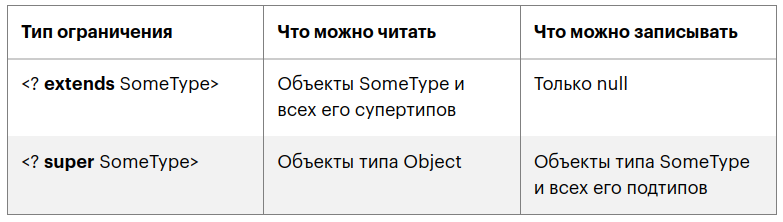

##  Type erasue (Стирание типа)

Компилятор стирает информацию о типе, заменяя все параметры **без ограничений** (unbounded) типом Object, а параметры **с границами** (bounded) — на эти границы.    
Кроме стирания (иногда говорят «затирания») типов, компилятор может добавлять **приведение (cast)** к нужному типу и создавать переходные **bridge-методы**, чтобы сохранить полиморфизм в классах-наследниках.

## Ограничения использования   

Generics нельзя использовать:
* наследники класса **Throwable**
* анонимные классы
* enum`ы

