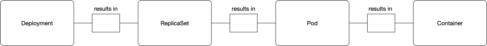

## Container

Любая программа и все ее зависимости могут быть объединены в один файл и затем опубликованы в Интернете. Любой может загрузить контейнер и развернуть его в своей инфраструктуре с минимальными настройками. Создание контейнера может быть сделано и скриптом, позволяя строить CI/CD пайплайны.

см. Docker

## Pods

Что такое Pods

Pods или поды — это абстрактный объект в кластере K8S, который состоит из одного или нескольких контейнеров с общим хранилищем и сетевыми ресурсами, а также спецификации для запуска контейнеров.

Это главный объект в кластере, в нем прописаны, какие контейнеры должны быть запущены, количество экземпляров или реплик, политика перезапуска, лимиты, подключаемые ресурсы, узел кластера для размещения.

## Deployments

Основная цель юзать подход с deployment состоит в том, чтобы настроить, сколько реплик pod'а должно работать одновременно. Когда развертывание добавляется в кластер, оно автоматически деплоит требуемое количество pod'ов и отслеживает их. Если pod умирает, deployment автоматически пересоздает его.

## Ingress

По умолчанию Kubernetes обеспечивает изоляцию между модулями и внешним миром. Если вы хотите общаться с сервисом, работающим в pod, вам нужно открыть канал для связи. Это называется Ingress.

Есть несколько способов добавить ingress в ваш кластер. Наиболее распространенными способами являются добавление либо ingress controller, либо LoadBalancer.

## Namespace

Namespace или пространство имен — это абстрактный объект, который логически разграничивает и изолирует ресурсы между подами. Вы можете рассматривать пространство имен как внутренний виртуальный кластер, который поможет вам изолировать проекты или пользователей между собой, применить разные политики квот на свои проекты или выдать права доступа только на определенную область.

## Основные контроллеры

### Deployments

Описание

контроллер, который управляет состоянием развертывания подов, которое описывается в манифесте, следит за удалением и созданием экземпляров подов. Управляет контроллерами ReplicaSet.

### ReplicaSet

Описание

гарантирует, что определенное количество экземпляров подов всегда будет запущено в кластере.

### StatefulSets

Описание

так же как и Deployments, управляет развертыванием и масштабированием набора подов, но сохраняет набор идентификаторов и состояние для каждого пода.

### DaemonSet

Описание

гарантирует, что на каждом узле кластера будет присутствовать экземпляр пода.

### Jobs

Описание

создает определенное количество подов и смотрит, пока они успешно не завершат работу. Если под завершился с ошибкой, повторяет создание, которое мы описали определенное количество раз. Если под успешно отработал, записывает это в свой журнал.

### CronJob

Описание

запускает контроллеры Jobs по определенному расписанию.

