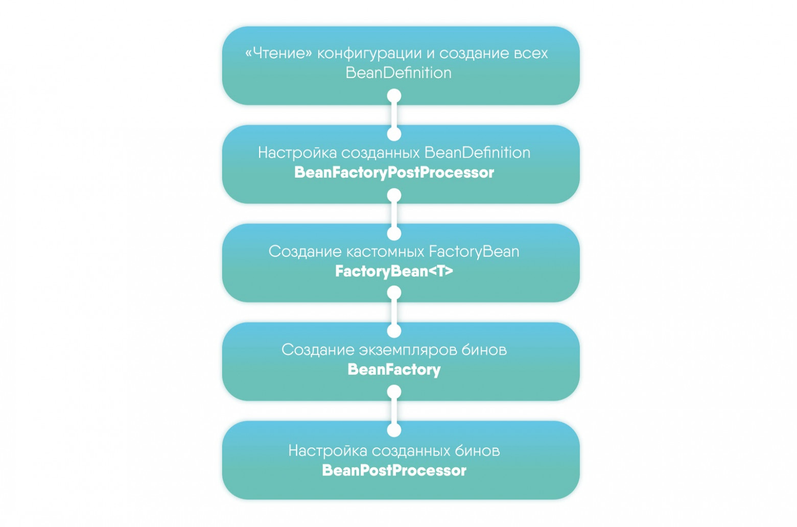

## ApplicationContext

Типы ApplicationContext:
* ClassPath*
* Xml*
* WebXml*
* Annotation*
* Groove*

___

## ApplicationContext initialization stages   

___

## ApplicationContextEvents

* **ContextRefreshedEvent** - публикуется, когда ApplicationContext инициализирован или обновлен, например, при использовании метода AbstractApplicationContext#refresh()
* **ContextStartedEvent** - публикуется, когда ApplicationContext запущен методом ConfigurableApplicationContext#start()
* **ContextStoppedEvent** - публикуется, когда ApplicationContext остановлен методом ConfigurableApplicationContext#stop()
* **ContextClosedEvent** - публикуется, когда ApplicationContext закрыт методом ConfigurableApplicationContext#close()
* **RequestHandledEvent** - web-событие, которое оповещает о том, что все бины из HTTP запроса были обработаны. Применимо только для web-приложений с использованием Spring DispatcherServlet
--